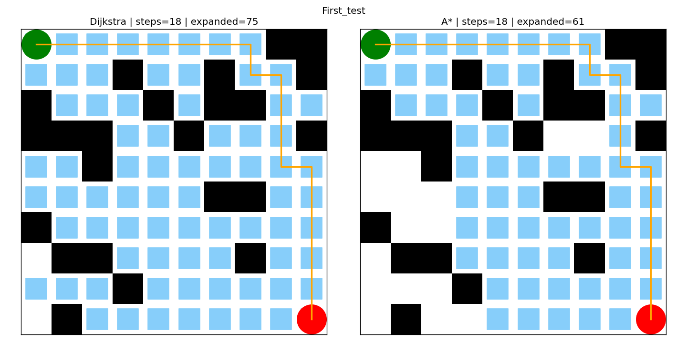
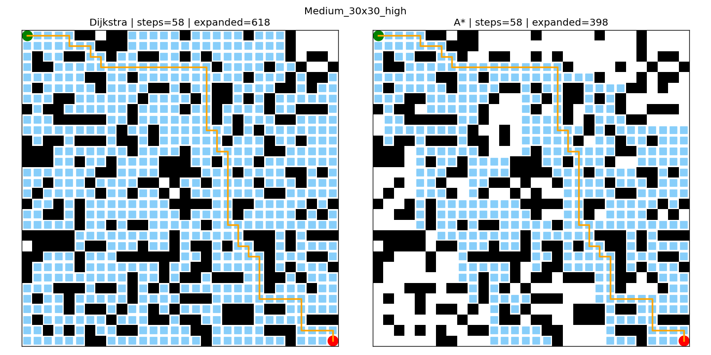
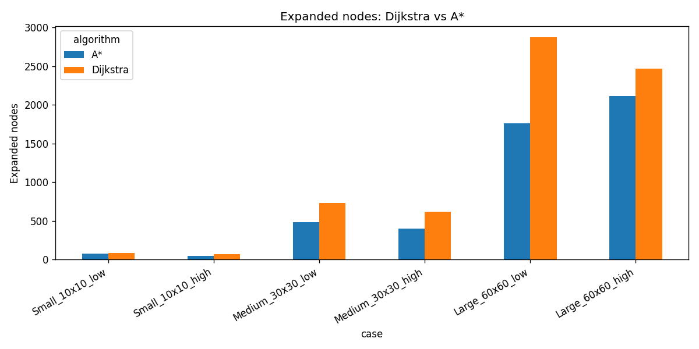

# Heuristic Pathfinding Agent: A* vs Dijkstra on Grid Mazes

A virtual agent that finds the shortest path through grid mazes with obstacles.
A* and Dijkstra's algorithm were both implemented **from scratch** in Python (only `heapq` from the standard library is used as the priority queue) and compared on six mazes of different sizes and obstacle densities.
Built as part of an Artificial Intelligence internship task (Task 3).

**Author:** Muhammad Moeez Manzoor

## How it works
- The maze is a grid: `0` = free cell, `1` = obstacle. The agent starts at the top-left cell and must reach the bottom-right cell, moving up, down, left or right.
- **Dijkstra** expands cells in order of their distance from the start. It has no idea where the goal is.
- **A\*** expands cells in order of `f = g + h`, where `g` is the distance travelled so far and `h` is the Manhattan distance to the goal. This pushes the search towards the goal.
- Mazes are generated with a fixed random seed, so both algorithms are always tested on exactly the same maze.

## Metrics tracked
| Metric | Meaning |
|---|---|
| Steps | Length of the path found |
| Expanded nodes | Number of cells the algorithm examined |
| Expanded density (%) | Expanded nodes divided by the number of free cells |
| Runtime (ms) | Average over 20 runs |

## Test mazes and results
| Case | Algorithm | Steps | Expanded nodes | Density (%) | Runtime (ms) |
|---|---|---|---|---|---|
| Small 10x10, 20% obstacles | Dijkstra | 18 | 85 | 100.0 | 0.363 |
| | A* | 18 | 75 | 88.2 | 0.322 |
| Small 10x10, 30% obstacles | Dijkstra | 18 | 67 | 90.5 | 0.587 |
| | A* | 18 | 46 | 62.2 | 0.454 |
| Medium 30x30, 20% obstacles | Dijkstra | 58 | 731 | 99.6 | 5.539 |
| | A* | 58 | 480 | 65.4 | 4.120 |
| Medium 30x30, 30% obstacles | Dijkstra | 58 | 618 | 97.5 | 4.783 |
| | A* | 58 | 398 | 62.8 | 3.532 |
| Large 60x60, 20% obstacles | Dijkstra | 118 | 2874 | 99.9 | 16.815 |
| | A* | 118 | 1762 | 61.2 | 8.630 |
| Large 60x60, 30% obstacles | Dijkstra | 128 | 2465 | 98.1 | 11.019 |
| | A* | 128 | 2118 | 84.3 | 9.989 |

The full results are also saved in `results/results_log.csv`.

### Path and searched cells (left: Dijkstra, right: A*)
Blue cells were examined by the algorithm, the orange line is the final path.

### Expanded nodes, all mazes

## Observations
- Both algorithms found paths of **the same length in all six mazes**, so both return the optimal path.
- **A\* expanded fewer cells in every maze** (between about 12% and 39% fewer) and was also faster in every run.
- The gain grows with maze size: in the 60x60 maze with 20% obstacles, A* needed about half the runtime of Dijkstra.
- With more obstacles (60x60, 30%) the gain is smaller, likely because walls force the agent to detour and the straight-line heuristic is less helpful.
- Each setting was tested on one generated maze, so the numbers describe those specific mazes and not an average over many mazes.

## Files
| File | Description |
|---|---|
| `Task3_Pathfinding.ipynb` | Google Colab notebook with the full code |
| `results/` | Visualizations of every maze and `results_log.csv` |
| `requirements.txt` | Python libraries |

## How to run
1. Open the notebook in Google Colab
2. Run all cells (no dataset is needed, the mazes are generated in the code)

## Tech stack
Python, NumPy, Pandas, Matplotlib
